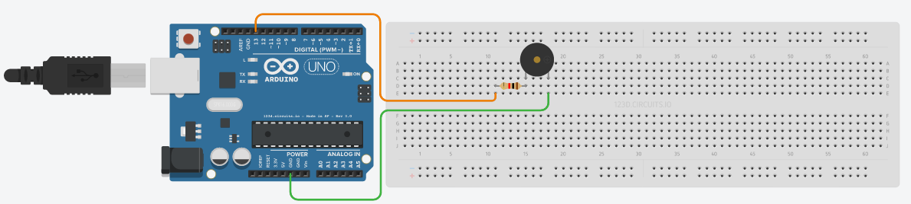
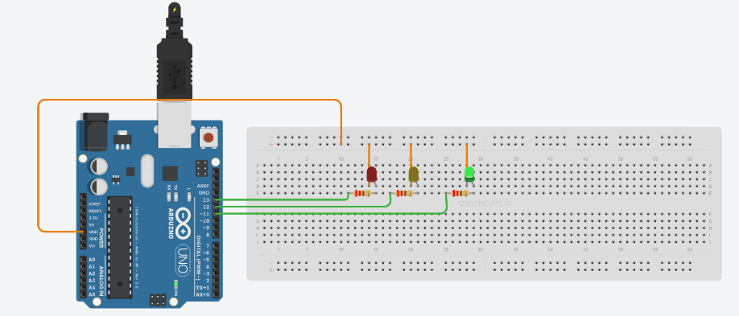
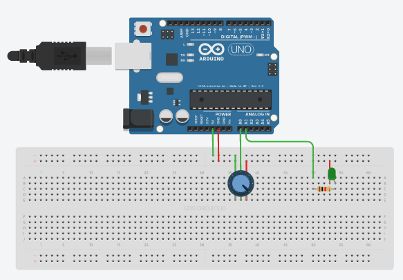

# Curso-Arduino-RaspberryPi

Curso Arduino y Raspberry Pi 2017

## Actividades

### Tema 1

- **Tarea 1**

### Tema 2

- **Tarea 2**

  [**Enlace**](https://circuits.io/circuits/4949199-tonos) 

### Tema 3

- **Semáforo** 

	

[**Enlace**](https://circuits.io/circuits/4953131-semaforo_mv) 

- **Tarea 3**

[**Enlace**](https://circuits.io/circuits/4951191-potentiometer-led) 

